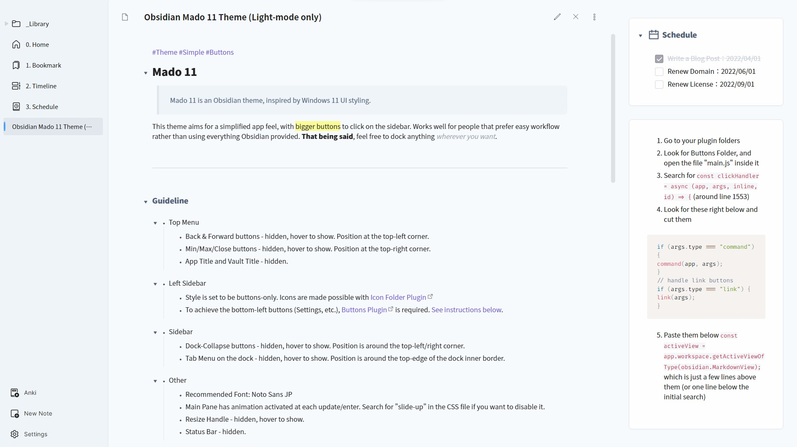

# Obsidian-Theme-Mado-11
 


Mado 11 is an Obsidian theme, inspired by Windows 11 UI styling.
This theme aims for a simplified app feel, with bigger buttons to click on the sidebar. Works well for people that prefer easy workflow rather than using everything Obsidian provided.
That being said, feel free to dock anything wherever you want.

###### Guideline

- Top Menu
	- Back & Forward buttons are hidden, show up when hovered. Position is at the top-left corner.
	- Min/Max/Close buttons are hidden, show up when hovered. Position is at the top-right corner.
	- App Title and Vault Title are hidden.
- Left Sidebar
	- Style is set to be buttons-only. Icons are made possible with [[Icon Folder Plugin]]
	- To achieve the bottom-left buttons (Settings, etc.), [[Buttons Plugin]] is required. Also requires two notes.
		1. One note to setup the buttons as usual. Icon can be setup here with [[Icons Plugin]].
		2. Another note to be used onto the dock. Simply make an inline-button of those that are setup above in the note.
			- An adjustment to the Buttons Plugin `main.js` file is required as of April 2022.
			> 1. Go to your plugin folders
			> 2. Look for Buttons Folder, and open the file "main.js" inside it 
			> 3. Search for `const clickHandler = async (app, args, inline, id) => {` (around line 1553)  
			> 4. Look for these right below and cut them  
			> ```js
			> if (args.type === "command") {  
			> 	command(app, args);  
			> }  
			> // handle link buttons  
			> if (args.type === "link") {  
			> 	link(args);  
			> }
			> ```
			> 5. Paste them below `const activeView = app.workspace.getActiveViewOfType(obsidian.MarkdownView);` which is just a few lines above them (or one line below the initial search)  
- Sidebar
	- Dock-Collapse buttons are hidden, show up when hovered. Position is around the top-left/right corner.
	- Tab Menu on the dock is hidden, show up when hovered. Position is around the top-edge of the dock inner border.
- Other
	- Font used: Noto Sans JP
	- Resize Handle is also hidden, and show up when hovered.
	- Main Pane has animation activated at each update/enter. Search for "slide-up" in the CSS file if you want to disable it.
	- Status Bar is hidden.