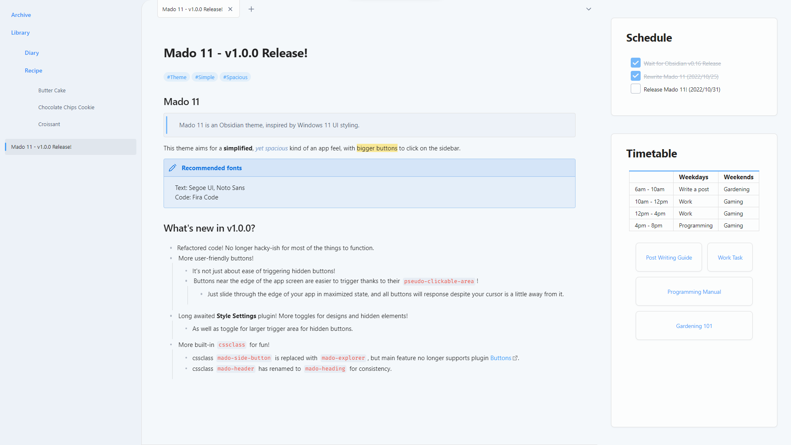
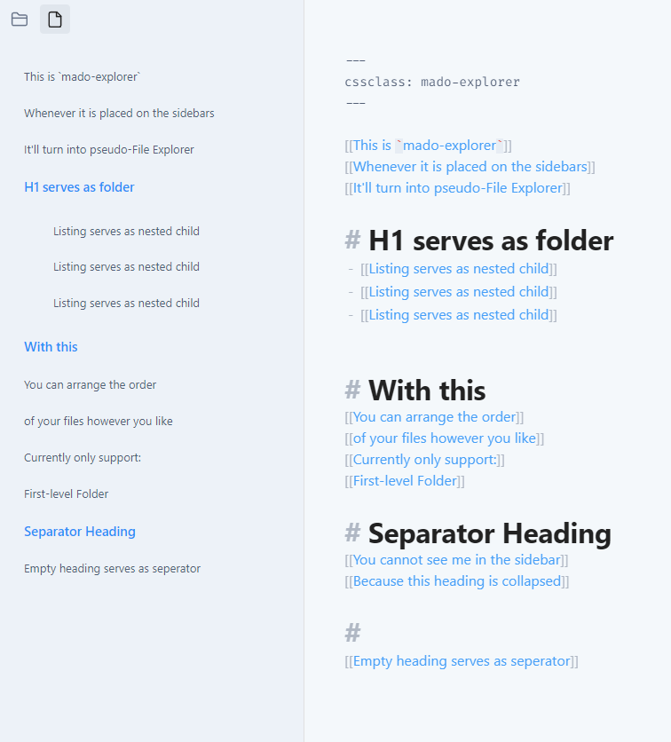
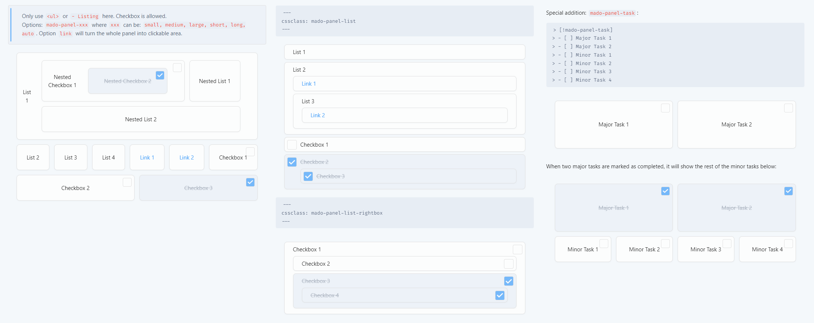
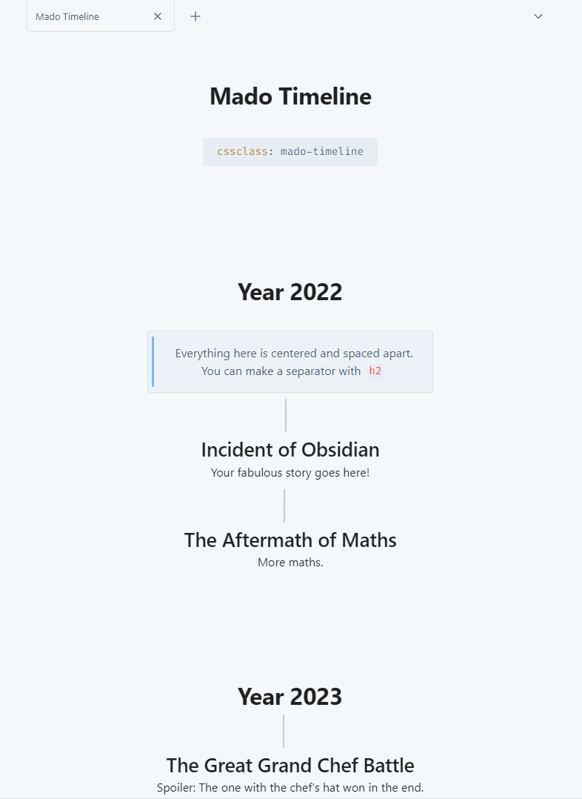
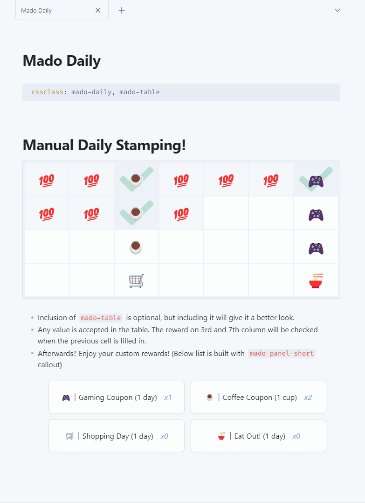

# Obsidian Theme - Mado 11
 
Mado 11 is an Obsidian theme, inspired by Windows 11 UI styling.

This theme aims for a simplified, yet spacious kind of an app feel, with bigger buttons to click on the sidebar.

(Looking for a more minimalism theme? Check out [Mado Miniflow](https://github.com/hydescarf/Obsidian-Theme-Mado-Miniflow)!)




Recommended fonts for this theme:
- Text: Segoe UI, Noto Sans
- Code: Fira Code


## Mado CSS Classes For Fun!
<details>
<summary><b>Mado-Heading</b></summary>


```
cssclass: mado-heading
```
Transforming your normal note into more bulky block button design!

</details>
<details>
<summary><b>Mado-Explorer</b></summary>



```
cssclass: mado-explorer
```

When placed onto the sidebar, it will become exactly like how File Explorer would look like. A.k.a. pseudo-File Explorer!
There are rules for this to work:

```
1. You may only use <a>(link), <h1>(h1 heading) and <li>(list) in the note.
2. <a> will act as first level file title.
3. <h1> will act as first level folder title.
4. <li> will act as first level folder's children, where its contents should fill with just <a>, and itself should be placed below <h1>.
5. Second level folder, or nested <li>, is not possible.
6. For <h1> to be foldable, you have to enable the foldable option in the settings.

```

Example:

```
[[File 1]]
[[File 2]]
# Folder 1
- [[Listed File 1]]
- [[Listed File 2]]
[[File 3]]
```

</details>
<details>
<summary><b>Mado-Table</b></summary>


```
cssclass: mado-table
```

Turns your normal-looking table into a fancy spacious one! With more options provided for you to tweak the like of it.
Example:

```
cssclass: mado-table (special styling)
cssclass: mado-table-XXX (special styling with XXX being the options)
cssclass: mado-table-XXX, mado-table-XXX (special styling with multiple options)
```

```
Options:
mado-table-auto (auto-widen table size by its contents and center it)
mado-table-normal (no special styling, include this if you wish to use other options without special styling)

mado-table-stripe, mado-table-border (stripe/border design)
mado-table-left, mado-table-right, mado-table-top, mado-table-bottom (define table-header position)
mado-table-topless (remove table-header position on the top)
```

</details>
<details>
<summary><b>Mado-Panel</b></summary>



```
cssclass: mado-panel
```

Turns your lists into panels! More fancy way to look and click. Also comes with options to tweak.
Example:

```
cssclass: mado-panel (transform all lists into panels)
cssclass: mado-panel-XXX (XXX being the options)
cssclass: mado-panel-XXX, mado-panel-XXX (including more options, in this case, only `auto` is available as an extra)

Options:
mado-panel-list (long and thin size, lists can be nested)
mado-panel-small, mado-panel-medium, mado-panel-large, mado-panel-long, mado-panel-short (define fixed-size, lists cannot be nested)
mado-panel-auto (maintain the minimum fixed-size of above, while auto-widen based on its contents, not applicable to mado-panel-list)
```

Rule:

```
1. Only <li>(list) will turned into panel.
2. The list can consist of <a>(link) or "[]"(Checkbox), or plain text.
3. Nested list is not available except for `mado-panel-list`.
```
Callout version is also available if you need only one part of the list to become panel.
Options in callout version can be chained directly.
Example:

```
> [!mado-panel-small-auto]
> - Listing
```

</details>
<details>
<summary><b>Mado-Timeline</b></summary>



```
cssclass: mado-timeline
```

Centers all of your element in the note! Not only that, using `<h1>` will form a huge space above it, while using `<h2>` will form a separator (a vertical `<hr>` or `---`) above it.

</details>
<details>
<summary><b>Mado-Daily</b></summary>

```
cssclass: mado-daily
```



Feel like logging into a game to turn in for daily bonus? Well, now you can with this manual-stamp daily!
You can set the reward for every 2nd and 5th day, and then start filling in with any value or emoji in the empty cells. The reward will mark as checked when the previous cell is filled in.
Also, adding in another cssclass `mado-table` will give it a better looking, optional of course!

</details>


## Changelog  

v1.0.0
- Refactored code to be less hacky and adapting Obsidian v1.0 new design.
- More user-friendly easy-to-click buttons that lie at the edges of the screen. 
- Easier triggering for more buttons.
- Implemented support for Style Settings plugin.
- Introduced more built-in cssclass for fun.
  - cssclass `mado-side-button` is replaced with `mado-explorer`, but main feature no longer supports plugin Buttons.
  - cssclass `mado-header` has renamed to `mado-heading` for consistency.

v0.3.3
- Remove height margin for `<hr>` or `---`.

v0.3.2
- Readjusted `titlebar` height style as previous version has disabled the dragging feature.

v0.3.1
- Additional "style-reverting", remove styles on button when it is on focus

v0.3.0
- "Revert" styles that are affected from the App update of v0.15.6.

v0.2.7
- Fixed close/min/max buttons being unclickable during "Translucent Window" mode.
- Adjusted the weird opacity design during "Translucent Window" mode.

v0.2.6
- Fixed close/min/max buttons position for MacOS.

v0.2.5
- Fixed left-sidebar for not properly showing the other plugins' pane.
- Left-sidebar bottom buttons now requires a frontmatter cssclass of `mado-side-button` to allow other custom notes to function.
- Fixed spacing issue for "Banner Plugin".
- Re-remove the background fading gradient on the title block as it blocks the editing path.
- Adjusted style for blockquote.
- Table is reverted to non-full width (only expands based on its content length).
- Table in `mado-header` however has a new styling.

v0.2.4
- Removed and readjusted most of the `!important` in the code to allow custom CSS Snippets to work easily. Some, however, are remained untouched so as to override inline CSS style.
- Various minor style changes

v0.2.3
- Applied hover-to-show for hidden ribbon docks (settings, change vault, etc.) and explorer buttons (new file, reorder, etc.)

v0.2.2
- Applied minor styling to Callout feature

v0.2.1
- Quick Fixes for background colours for codeblock and scrollbar

v0.2.0
- Adjusted various styling, especially for those in dark mode
  - ==Highlight== is now underlined in dark mode
  - **Bold** text is now coloured
  - `Code Colour` is now more readable with a brighter red version
  - Other small changes
- Implemented special CSS class ["mado-header"](#Special-class-mado-header)

v0.1.0
- Release!