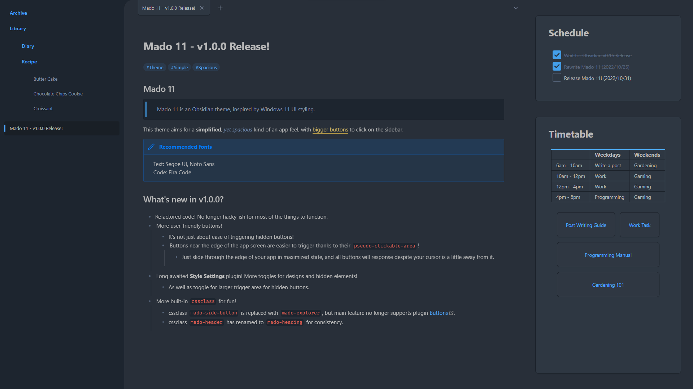
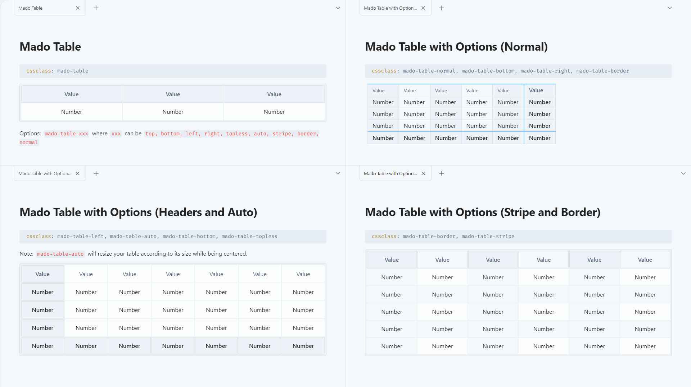

# Obsidian Theme - Mado 11
 
Mado 11 is an Obsidian theme, inspired by Windows 11 UI styling.

This theme aims for a simplified, yet spacious kind of an app feel, with bigger buttons to click on the sidebar.

(Looking for a more minimalism theme? Check out [Mado Miniflow](https://github.com/hydescarf/Obsidian-Theme-Mado-Miniflow)!)

Recommended fonts for this theme:
- Text: Segoe UI, Noto Sans
- Code: Fira Code

## Mado CSS Classes For Fun!

- **Mado-Heading**, for an alternative bulky button feel!

- **Mado-Table**, fancy spacious table with few options such as header-positions `top, bottom, left, right, topless`, styling `stripe, border`, without the fancy style `normal`, and auto-widen `auto`.

- **Mado-Panel**, turns all of your lists into panels. Options come with collapsible `list`, panel fixed-sizing `small, medium, large, long, short` with auto-resize `auto`.
  
- Callout version comes with `task` option.
  

- **Mado-Explorer**, turns your note into pseudo-File Explorer.

- **Mado-Timeline**, centering all elements with minor special adjustment.

- **Mado-Daily**, manually stamp your daily card for continuous-streak bonus at every 2nd and 5th day!

## Changelog  

v1.0.0
- Refactored code to be less hacky and adapting Obsidian v1.0 new design.
- More user-friendly easy-to-click buttons that lie at the edges of the screen. 
- Easier triggering for more buttons.
- Implemented support for Style Settings plugin.
- Introduced more built-in cssclass for fun.
  - cssclass `mado-side-button` is replaced with `mado-explorer`, but main feature no longer supports plugin Buttons.
  - cssclass `mado-header` has renamed to `mado-heading` for consistency.

v0.3.3
- Remove height margin for `
` or `---`.

v0.3.2
- Readjusted `titlebar` height style as previous version has disabled the dragging feature.

v0.3.1
- Additional "style-reverting", remove styles on button when it is on focus

v0.3.0
- "Revert" styles that are affected from the App update of v0.15.6.

v0.2.7
- Fixed close/min/max buttons being unclickable during "Translucent Window" mode.
- Adjusted the weird opacity design during "Translucent Window" mode.

v0.2.6
- Fixed close/min/max buttons position for MacOS.

v0.2.5
- Fixed left-sidebar for not properly showing the other plugins' pane.
- Left-sidebar bottom buttons now requires a frontmatter cssclass of `mado-side-button` to allow other custom notes to function.
- Fixed spacing issue for "Banner Plugin".
- Re-remove the background fading gradient on the title block as it blocks the editing path.
- Adjusted style for blockquote.
- Table is reverted to non-full width (only expands based on its content length).
- Table in `mado-header` however has a new styling.

v0.2.4
- Removed and readjusted most of the `!important` in the code to allow custom CSS Snippets to work easily. Some, however, are remained untouched so as to override inline CSS style.
- Various minor style changes

v0.2.3
- Applied hover-to-show for hidden ribbon docks (settings, change vault, etc.) and explorer buttons (new file, reorder, etc.)

v0.2.2
- Applied minor styling to Callout feature

v0.2.1
- Quick Fixes for background colours for codeblock and scrollbar

v0.2.0
- Adjusted various styling, especially for those in dark mode
  - ==Highlight== is now underlined in dark mode
  - **Bold** text is now coloured
  - `Code Colour` is now more readable with a brighter red version
  - Other small changes
- Implemented special CSS class ["mado-header"](#Special-class-mado-header)

v0.1.0
- Release!